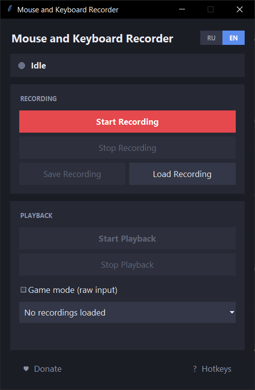
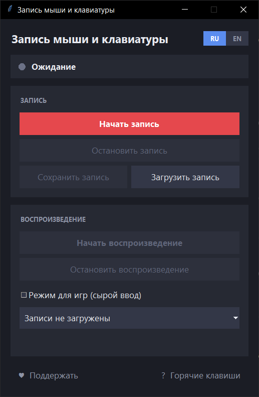

# Auto Clicker: Mouse and Keyboard Recorder

[English](#english) | [Русский](#русский)

## English

Auto Clicker: Mouse and Keyboard Recorder is a small Windows program that records mouse and keyboard actions and plays them back with the original timing. It records mouse movement, clicks, wheel scrolling and key presses and releases. The interface is a dark Tkinter window, bilingual Russian/English, with Russian as the default language.



### Features

- Records mouse movement, mouse clicks (press and release, any button), mouse wheel scrolling, and keyboard key presses and releases.
- Playback reproduces the recorded events with their original timing.
- Pauses between repeats can be set manually or randomly, with a chosen number of repeats.
- Recordings are saved and loaded as plain JSON files.
- Dark Tkinter interface with an instant RU/EN switch in the header (Russian by default).
- Game mode (raw input) for games that rotate the camera from raw relative mouse movement.
- DPI aware: at 125%/150% screen scaling, playback hits the same screen positions.
- Clicks on the program's own "Start Recording" / "Stop Recording" buttons are not recorded.
- Donate window with a QR code, the list of networks, the wallet address and a "Copy address" button.
- Hotkeys while the program's window is active, plus a "? Hotkeys" help window.

### Requirements

- Windows only (the program uses the Win32 API through ctypes for DPI awareness, Raw Input and the dark title bar).
- Python 3 for Windows. Developed and tested on Windows 10 with Python 3.14; other versions were not tested.
- `pynput` — required.
- `qrcode` — optional, only for the QR code in the donate window. Without it the program works and simply shows no QR.
- Tkinter ships with the standard Windows Python installer.

### Installation and launch

1. Install Python for Windows (Tkinter is included in the standard Windows Python installer).

2. Install the dependencies. `pynput` is required, `qrcode` is optional:

    ```bash
    pip install pynput qrcode
    ```

3. Start the program:

    ```bash
    python AutoClicker.py
    ```

### How to use

#### Recording

- Click "Start Recording" (or press Ctrl+T). The program records mouse movement, clicks, wheel scrolling and key presses and releases.
- Click "Stop Recording" (or press Ctrl+R) to stop.
- Clicks on the program's own "Start Recording" / "Stop Recording" buttons are not recorded.

#### Playback

- Click "Start Playback" (or press Ctrl+E). A dialog asks how to set the pauses between repeats:
  - **Manual**: first the number of repeats, then a pause in seconds for each repeat. The button "Set same for all following" fills the remaining repeats with the current value.
  - **Random**: minimum pause, maximum pause and the number of repeats; each pause is a random value in that range.
- A pause follows each repeat and is counted down in whole seconds. While waiting, the window shows a countdown such as "Next repeat in: 5s (Repeat 2/7)".
- "Stop Playback" (or Ctrl+W) stops playback at any time.
- If you want game mode, turn it on before starting playback (see "Game mode" below).

#### Saving and loading

- "Save Recording" writes the recorded events to a `.json` file.
- "Load Recording" loads a `.json` file; loaded recordings appear in the dropdown in the Playback card.

### Hotkeys

| Shortcut | Action |
| --- | --- |
| Ctrl+T | Start recording |
| Ctrl+R | Stop recording |
| Ctrl+E | Start playback |
| Ctrl+W | Stop playback |
| F1 | Show the hotkeys help |

Hotkeys work only while this program's window is active; there are no global hotkeys. The "? Hotkeys" button shows the same table.

### Game mode

- The "Game mode (raw input)" checkbox is in the Playback card. It is off by default and applies at the moment playback starts, so turn it on before pressing "Start Playback".
- Some games (for example Roblox) rotate the camera from raw relative mouse movement while the right button is held and ignore ordinary cursor teleporting. During recording the program also captures raw relative mouse deltas (`raw_move` events). With game mode on, while the right button is held, playback sends these relative movements (through SendInput) instead of moving the cursor.
- Verified to work in Roblox.

### Recording file format

A recording file is a JSON list of events sorted by time (`time` is in seconds from the start of the recording; special keys are stored by name, for example `enter` or `shift`, and ordinary keys by character):

```json
[
  {"type": "move",     "time": 0.52, "x": 640, "y": 360},
  {"type": "click",    "time": 0.81, "x": 640, "y": 360, "button": "left", "action": "press"},
  {"type": "click",    "time": 0.92, "x": 640, "y": 360, "button": "left", "action": "release"},
  {"type": "scroll",   "time": 1.40, "x": 640, "y": 360, "dx": 0, "dy": -1},
  {"type": "raw_move", "time": 1.50, "dx": 3, "dy": -2},
  {"type": "key",      "time": 2.00, "key": "a", "action": "press"}
]
```

### Notes and limitations

- Windows only.
- Wheel scrolling is recorded in whole notches; fine touchpad scrolling is rounded.
- If the target program runs as administrator, run this program as administrator too — otherwise Windows blocks input into elevated windows.
- Some games and anti-cheat systems detect or forbid automated input; you are responsible for following the rules of the software you use it with.

### Support the author

The program is free, and if it is useful to you, you can support the author with crypto.


Networks: Ethereum, BNB Chain, Arbitrum, Polygon, Optimism, Mantle and other EVM networks.

```
0x174e74791362b91bfab12445f279ce6e062e3c79
```

The same address works for all EVM networks. Check the network in your wallet before sending. Do not send from non-EVM networks (Bitcoin, Solana, Tron): the funds would be lost.

The same QR code and a copy button are in the program, behind the "♥ Donate" button.

## Русский

Auto Clicker: Mouse and Keyboard Recorder — небольшая программа для Windows, которая записывает действия мыши и клавиатуры и воспроизводит их с исходным таймингом. Она записывает движение мыши, клики, прокрутку колеса, нажатия и отпускания клавиш. Интерфейс — тёмное окно на Tkinter с переключением языка RU/EN, по умолчанию русский.



### Возможности

- Записывает движение мыши, клики (нажатие и отпускание, любая кнопка), прокрутку колеса, нажатия и отпускания клавиш.
- Воспроизведение повторяет записанные события с исходным таймингом.
- Паузы между повторами задаются вручную или случайно, с указанием числа повторов.
- Записи сохраняются и загружаются как обычные JSON-файлы.
- Тёмный интерфейс на Tkinter с мгновенным переключением RU/EN в шапке (по умолчанию русский).
- Режим для игр (сырой ввод) для игр, которые вращают камеру по сырым относительным смещениям мыши.
- Учитывается масштабирование экрана: при 125%/150% воспроизведение попадает в те же точки экрана.
- Клики по кнопкам самой программы «Начать запись» / «Остановить запись» в запись не попадают.
- Окно доната с QR-кодом, списком сетей, адресом кошелька и кнопкой «Копировать адрес».
- Горячие клавиши, пока окно программы активно, и окно подсказки по кнопке «? Горячие клавиши».

### Требования

- Только Windows (программа использует Win32 API через ctypes: DPI awareness, Raw Input, тёмный заголовок окна).
- Python 3 для Windows. Разработка и тестирование: Windows 10, Python 3.14; другие версии не проверялись.
- `pynput` — обязательно.
- `qrcode` — необязательно, только для QR-кода в окне доната. Без неё программа работает, просто без QR.
- Tkinter входит в стандартный установщик Python для Windows.

### Установка и запуск

1. Установите Python для Windows (Tkinter входит в стандартный установщик Python для Windows).

2. Установите зависимости. `pynput` обязателен, `qrcode` необязателен:

    ```bash
    pip install pynput qrcode
    ```

3. Запустите программу:

    ```bash
    python AutoClicker.py
    ```

### Как пользоваться

#### Запись

- Нажмите «Начать запись» (или Ctrl+T). Программа записывает движение мыши, клики, прокрутку колеса, нажатия и отпускания клавиш.
- Нажмите «Остановить запись» (или Ctrl+R), чтобы остановить запись.
- Клики по кнопкам самой программы «Начать запись» / «Остановить запись» в запись не попадают.

#### Воспроизведение

- Нажмите «Начать воспроизведение» (или Ctrl+E). В диалоговом окне выберите, как задавать паузы между повторами:
  - **Вручную**: сначала число повторов, затем пауза в секундах для каждого повтора. Кнопка «Одинаковый для всех следующих» заполняет оставшиеся повторы текущим значением.
  - **Случайно**: минимальная пауза, максимальная пауза и число повторов; каждая пауза — случайное значение из этого диапазона.
- Пауза следует за каждым повтором и отсчитывается целыми секундами. Во время ожидания окно показывает обратный отсчёт, например «Следующий повтор через 5 с (повтор 2/7)».
- «Остановить воспроизведение» (или Ctrl+W) останавливает воспроизведение в любой момент.
- Если нужен режим для игр, включите его до запуска воспроизведения (см. «Режим для игр»).

#### Сохранение и загрузка

- «Сохранить запись» записывает события в файл `.json`.
- «Загрузить запись» загружает файл `.json`; загруженные записи появляются в выпадающем списке в карточке воспроизведения.

### Горячие клавиши

| Сочетание | Действие |
| --- | --- |
| Ctrl+T | Начать запись |
| Ctrl+R | Остановить запись |
| Ctrl+E | Начать воспроизведение |
| Ctrl+W | Остановить воспроизведение |
| F1 | Показать подсказку |

Горячие клавиши работают, только пока окно программы активно; глобальных горячих клавиш нет. Кнопка «? Горячие клавиши» показывает ту же таблицу.

### Режим для игр

- Флажок «Режим для игр (сырой ввод)» находится в карточке воспроизведения. По умолчанию он выключен и применяется в момент запуска воспроизведения, поэтому включите его до нажатия «Начать воспроизведение».
- Некоторые игры (например Roblox) вращают камеру по сырым относительным смещениям мыши при зажатой правой кнопке и игнорируют обычное перемещение курсора. При записи программа также записывает сырые относительные смещения мыши (события `raw_move`). Если режим для игр включён, при зажатой правой кнопке воспроизведение отправляет эти относительные смещения (через SendInput) вместо перемещения курсора.
- Проверено в Roblox.

### Формат файла записи

Файл записи — это JSON-список событий, отсортированный по времени (`time` — секунды от начала записи; специальные клавиши хранятся по имени, например `enter` или `shift`, обычные — по символу):

```json
[
  {"type": "move",     "time": 0.52, "x": 640, "y": 360},
  {"type": "click",    "time": 0.81, "x": 640, "y": 360, "button": "left", "action": "press"},
  {"type": "click",    "time": 0.92, "x": 640, "y": 360, "button": "left", "action": "release"},
  {"type": "scroll",   "time": 1.40, "x": 640, "y": 360, "dx": 0, "dy": -1},
  {"type": "raw_move", "time": 1.50, "dx": 3, "dy": -2},
  {"type": "key",      "time": 2.00, "key": "a", "action": "press"}
]
```

### Замечания и ограничения

- Только Windows.
- Прокрутка колеса записывается целыми щелчками; плавная прокрутка тачпада округляется.
- Если целевая программа запущена от имени администратора, запустите эту программу тоже от администратора — иначе Windows блокирует ввод в окна с повышенными правами.
- Некоторые игры и античит-системы распознают или запрещают автоматический ввод; ответственность за соблюдение правил используемого ПО лежит на вас.

### Поддержать автора

Программа бесплатная, и если она вам полезна, автора можно поддержать криптовалютой.


Сети: Ethereum, BNB Chain, Arbitrum, Polygon, Optimism, Mantle и другие EVM-сети.

```
0x174e74791362b91bfab12445f279ce6e062e3c79
```

Один адрес работает во всех EVM-сетях. Перед отправкой проверьте сеть в своём кошельке. Не отправляйте из сетей, не относящихся к EVM (Bitcoin, Solana, Tron): средства будут потеряны.

Тот же QR-код и кнопка копирования есть в программе, за кнопкой «♥ Поддержать».
